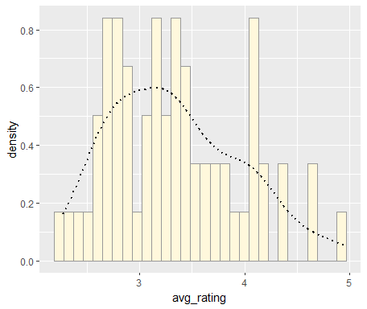
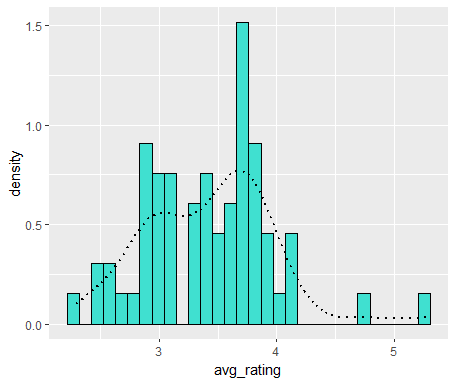
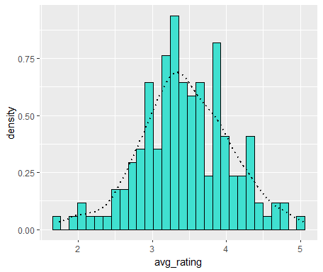
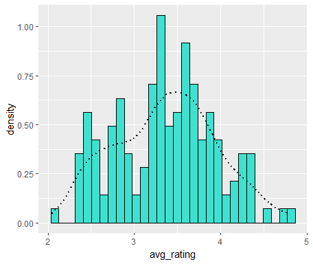

```{r setup, include=FALSE}
knitr::opts_chunk$set(echo = TRUE)
```

## Randomized Data

Ran successfully with this code

    z <- rnorm(n=3000,mean=0.2)
    z <- data.frame(1:3000,z)
    names(z) <- list("ID","myVar")
    z <- z[z$myVar>0,]
    str(z)
    summary(z$myVar)


    # Histogram

    p1 <- ggplot(data=z, aes(x=myVar, y=..density..)) +
      geom_histogram(color="grey60",fill="cornsilk",size=0.2) 
    print(p1)

    # Modification: empirical density curve
    p1 <-  p1 +  geom_density(linetype="dotted",size=0.75) # "smoothes" our histogram
    print(p1)


    # Maximum Likelihood for Normal dist

    normPars <- fitdistr(z$myVar,"normal") # parameters of dataset IF it's normal
    print(normPars)
    str(normPars)
    normPars$estimate["mean"] # note structure of getting a named attribute


    # Plotting probability density of normal distr

    meanML <- normPars$estimate["mean"] # ML = max likelihood
    sdML <- normPars$estimate["sd"]

    xval <- seq(0,max(z$myVar),len=length(z$myVar))

    stat <- stat_function(aes(x = xval, y = ..y..), fun = dnorm, colour="red", n = length(z$myVar), args = list(mean = meanML, sd = sdML))
    p1 + stat # prints both on overlapping
    # observe that it's not a great fit


    # Plotting Exponential probability density
    # same thing we did before, but with exponential model

    expoPars <- fitdistr(z$myVar,"exponential")
    rateML <- expoPars$estimate["rate"]

    stat2 <- stat_function(aes(x = xval, y = ..y..), fun = dexp, colour="blue", n = length(z$myVar), args = list(rate=rateML))
    p1 + stat + stat2
    # also doesn't look perfect


    # Uniform probability density/distribution

    stat3 <- stat_function(aes(x = xval, y = ..y..), fun = dunif, colour="darkgreen", n = length(z$myVar), args = list(min=min(z$myVar), max=max(z$myVar)))
    # note no need for fitdistr, just use min and max
    p1 + stat + stat2 + stat3


    # Gamma probability distribution

    gammaPars <- fitdistr(z$myVar,"gamma")
    shapeML <- gammaPars$estimate["shape"]
    rateML <- gammaPars$estimate["rate"]

    stat4 <- stat_function(aes(x = xval, y = ..y..), fun = dgamma, colour="brown", n = length(z$myVar), args = list(shape=shapeML, rate=rateML))
    p1 + stat + stat2 + stat3 + stat4
    # looks pretty good


    # Beta probability distribution
    # requires a replotting to scale data between 1 and 0

    pSpecial <- ggplot(data=z, aes(x=myVar/(max(myVar + 0.1)), y=..density..)) +
      geom_histogram(color="grey60",fill="cornsilk",size=0.2) + 
      xlim(c(0,1)) +
      geom_density(size=0.75,linetype="dotted")

    betaPars <- fitdistr(x=z$myVar/max(z$myVar + 0.1),start=list(shape1=1,shape2=2),"beta")
    shape1ML <- betaPars$estimate["shape1"]
    shape2ML <- betaPars$estimate["shape2"]

    statSpecial <- stat_function(aes(x = xval, y = ..y..), fun = dbeta, colour="orchid", n = length(z$myVar), args = list(shape1=shape1ML,shape2=shape2ML))
    pSpecial + statSpecial

Gamma appeared to fit this dataset best, though it was similar to normal

## Real Data trial

Data was colelcted from Beam et al. 2020, a correspondence study of young workers in the Philippines. AS part of the study, photos sent in along with the fake resumes were rated in attractiveness from 1 (low) to 7 (high) by 50 Filipinos (male and female). The result was averaged for each photo.

    z <- read.table("CleanedData.csv",header=TRUE,sep=",")
    str(z)
    summary(z)

    # cleaning it for our simplified purposes!
    library(dplyr)
    z <- dplyr::select(z, photo, avg_rating, photo_gender)
    z <- unique(z)
    z <- arrange(z, photo)

    # Histogram
    p1 <- ggplot(data=z, aes(x=avg_rating, y=..density..)) +
      geom_histogram(color="grey60",fill="cornsilk",size=0.2) 
    print(p1)

    # Density curve
    p1 <-  p1 +  geom_density(linetype="dotted",size=0.75)
    print(p1)


    # Normal
    normPars <- fitdistr(z$avg_rating,"normal")


    meanML <- normPars$estimate["mean"]
    sdML <- normPars$estimate["sd"]

    xval <- seq(0,max(z$avg_rating),len=length(z$avg_rating))

    stat <- stat_function(aes(x = xval, y = ..y..), fun = dnorm, colour="red", n = length(z$avg_rating), args = list(mean = meanML, sd = sdML))

    p1 + stat

    # Exponential
    expoPars <- fitdistr(z$avg_rating,"exponential")
    rateML <- expoPars$estimate["rate"]

    stat2 <- stat_function(aes(x = xval, y = ..y..), fun = dexp, colour="blue", n = length(z$avg_rating), args = list(rate=rateML))

    p1 + stat + stat2

    # Uniform
    stat3 <- stat_function(aes(x = xval, y = ..y..), fun = dunif, colour="darkgreen", n = length(z$avg_rating), args = list(min=min(z$avg_rating), max=max(z$avg_rating)))

    p1 + stat + stat2 + stat3

    # Gamma
    gammaPars <- fitdistr(z$avg_rating,"gamma")
    shapeML <- gammaPars$estimate["shape"]
    rateML <- gammaPars$estimate["rate"]

    stat4 <- stat_function(aes(x = xval, y = ..y..), fun = dgamma, colour="brown", n = length(z$avg_rating), args = list(shape=shapeML, rate=rateML))

    p1 + stat + stat2 + stat3 + stat4

    # Beta

    pSpecial <- ggplot(data=z, aes(x=avg_rating/(max(avg_rating + 0.1)), y=..density..)) +
      geom_histogram(color="grey60",fill="cornsilk",size=0.2) + 
      xlim(c(0,1)) +
      geom_density(size=0.75,linetype="dotted")
    # maybe not a great way to set this up

    betaPars <- fitdistr(x=z$avg_rating/max(z$avg_rating + 0.1),start=list(shape1=1,shape2=2),"beta")
    shape1ML <- betaPars$estimate["shape1"]
    shape2ML <- betaPars$estimate["shape2"]

    statSpecial <- stat_function(aes(x = xval, y = ..y..), fun = dbeta, colour="orchid", n = length(z$avg_rating), args = list(shape1=shape1ML,shape2=shape2ML))
    pSpecial + statSpecial

This generates an image which looks like:

The gamma distribution (brown) appears to be the best fit here, although it's very similar to the normal. This is a small dataset of only 64 values

## Simulating New Data from our closest model

We have chosen a gamma model for our simulation(s)

    # Gamma Maximum Likelihood parameters:
    shapeML
    rateML
    # found earlier

    # New Simulation
    Sim1 <- rgamma(64, shape=shapeML, rate=rateML)
    Sim1 <- data.frame(Sim1)
    Sim1 <- rename(Sim1, avg_rating = Sim1)

    # Histogram
    pSim <- ggplot(data=Sim1, aes(x=avg_rating, y=..density..)) +
      geom_histogram(color="black",fill="turquoise",size=0.2) 
    print(pSim)

    pSim <-  pSim +  geom_density(linetype="dotted",size=0.75) # "smoothes" our histogram
    print(pSim)

    print(p1)


    # Good job now do it again
    Sim2 <- rgamma(150, shape=shapeML, rate=rateML)
    Sim2 <- data.frame(Sim2)
    Sim2 <- rename(Sim2, avg_rating = Sim2)


    pSim2 <- ggplot(data=Sim2, aes(x=avg_rating, y=..density..)) +
      geom_histogram(color="black",fill="turquoise",size=0.2) 
    print(pSim2)

    pSim2 <-  pSim2 +  geom_density(linetype="dotted",size=0.75) # "smoothes" our histogram
    print(pSim2)


    # We must imagine Sisyphus happy
    Sim3 <- rgamma(150, shape=shapeML, rate=rateML)
    Sim3 <- data.frame(Sim3)
    Sim3 <- rename(Sim3, avg_rating = Sim3)


    pSim3 <- ggplot(data=Sim3, aes(x=avg_rating, y=..density..)) +
      geom_histogram(color="black",fill="turquoise",size=0.2) 
    print(pSim3)

    pSim3 <-  pSim3 +  geom_density(linetype="dotted",size=0.75) # "smoothes" our histogram
    print(pSim3)


    # put them all back-to-back
    print(p1)
    print(pSim)
    print(pSim2)
    print(pSim3)

```{r, echo=FALSE}

```

```{r, echo=FALSE}

```

```{r, echo=FALSE}

```

```{r, echo=FALSE}

```

The gamma distribution looks mostly accurate to the original data's distribution. It's a little more left-heavy, but that may be due to the original data having a small sample size. This may also explain why the real data is not as unimodal as the simulations.
