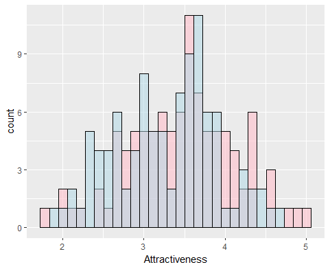
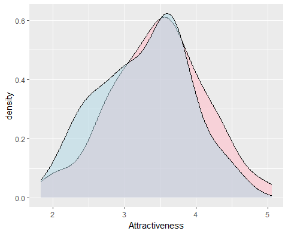

```{r setup, include=FALSE}
knitr::opts_chunk$set(echo = TRUE)
```

# Homework 8:

## Creating Fake Datasets to Explore Hypotheses


### 1&2. Choose a dataset you have access to. Get the sample sizes, means, and variances for each group.

(We're going to assume they're normally distributed, for now)

I'll choose the data on attractiveness I used last time:
```
z <- read.table("CleanedData.csv",header=TRUE,sep=",")
str(z)
summary(z)

# cleaning it for our simplified purposes!
library(dplyr)
z <- dplyr::select(z, photo, avg_rating, photo_gender)
z <- unique(z)
z <- arrange(z, photo)
```
Then I'll split it into two groups, male and female
```
Men <- filter(z, photo_gender=="Male")
Women <- filter(z, photo_gender == "Female")

```
Then I'll fit each to a normal distribution and take the parameters
```
normPars <- fitdistr(z$avg_rating,"normal")


meanML <- normPars$estimate["mean"]
sdML <- normPars$estimate["sd"]
```
### 3. Construct a random dataset with these attributes

I'm actually making two datasets, to compare.

(I've upped the sample size simply for my own convenience, it's all fake anyway!).
```
MenRandAttr <- rnorm(100, mean=menMean, sd=menSD)

WomenRandAttr <- rnorm(100, mean=womenMean, sd=womenSD)

# these are only vectors, so let's make them a dataframe:

MenRandAttr <- data.frame(MenRandAttr) %>%
  rename(MenRandAttr,Attractiveness=MenRandAttr)

WomenRandAttr <- data.frame(WomenRandAttr) %>%
  rename(WomenRandAttr,Attractiveness=WomenRandAttr)
```

### 4. Analyze the random data. Generate a useful graph.

```
ttest <- t.test(MenRandAttr[,1], y = WomenRandAttr[1], alternative="two.sided")

print(ttest)
# data:  MenRandAttr[, 1] and WomenRandAttr[1]
# t = -0.72131, df = 179.88, p-value = 0.4717
# alternative hypothesis: true difference in means is not equal to 0
# 95 percent confidence interval:
#  -0.2333255  0.1084072
# sample estimates:
# mean of x     mean of y 
# 3.283923      3.346382 


# ggplot histogram

ComparisonHist <- ggplot(data=WomenRandAttr, aes(x=Attractiveness)) +
  geom_histogram(fill="pink", color="black", alpha=0.60) +
  geom_histogram(data=MenRandAttr,
                  fill="lightblue", color="black", alpha=0.5)

ComparisonSmooth <- ggplot(data=WomenRandAttr, aes(x=Attractiveness)) +
  geom_density(fill="pink", color="black", alpha=0.60) +
  geom_density(data=MenRandAttr,
                 fill="lightblue", color="black", alpha=0.5)

print(ComparisonHist)
save(ComparisonHist,file="Comparison1.png")

print(ComparisonSmooth)
save(ComparisonSmooth,file="Comparison2.png")
```
```{r, echo=FALSE}
knitr::include_graphics("Comparison1.png")
```
```{r, echo=FALSE}
knitr::include_graphics("Comparison2.png")
```


### 5. Second trial with new randomized data.

I'm using the same code, the random numbers will just be different.

t-test results:
```
data:  MenRandAttr[, 1] and WomenRandAttr[1]
t = -2.0533, df = 197.75, p-value = 0.04136
alternative hypothesis: true difference in means is not equal to 0
95 percent confidence interval:
 -0.366064179 -0.007388102
sample estimates:
mean of x mean of y 
 3.276001  3.462727 
```
The p-value is >0.05, but these data are not significantly different?

Histograms:
```{r, echo=FALSE}

```
```{r, echo=FALSE}

```

Those look very different from last time!


### 6. Adjusting the means.

What is the minimum mean adjustment we can detect with our sample size?

Adjusting the women's mean by 0.5 units:
```
WomenRandAttr <- rnorm(100, mean=(womenMean+0.5), sd=womenSD)
# I could also adjust the actual variable, but I want to preserve that
```
gets us a ttest result of
```
data:  MenRandAttr[, 1] and WomenRandAttr[1]
t = -1.0845, df = 195.15, p-value = 0.2795
alternative hypothesis: true difference in means is not equal to 0
95 percent confidence interval:
 -0.25998997  0.07550589
sample estimates:
mean of x mean of y 
 3.175972  3.268214 
```
still not detected as significant.

We could adjust the women's mean a different way:
```
WomenRandAttr <- rnorm(100, mean=(menMean*1.25), sd=womenSD)

# We adjusted the MEN's mean and used that, so we can't accidentally make them MORE similar

# We also make it 25% larger, instead of using a flat number. This is more or less dramatic depending on what your units are (eg. pH behaves differently than Popularity)
```
which gets us
```
data:  MenRandAttr[, 1] and WomenRandAttr[1]
t = -9.5811, df = 188.76, p-value < 2.2e-16
alternative hypothesis: true difference in means is not equal to 0
95 percent confidence interval:
 -1.0441333 -0.6875965
sample estimates:
mean of x mean of y 
 3.175972  4.041837
```
so that's obviously a much larger change.

Let's try a smaller increase:
```
WomenRandAttr <- rnorm(100, mean=(menMean+0.6), sd=womenSD)
```
which produces:
```
data:  MenRandAttr[, 1] and WomenRandAttr[1]
t = -8.856, df = 193.16, p-value =
5.364e-16
alternative hypothesis: true difference in means is not equal to 0
95 percent confidence interval:
 -0.9412660 -0.5983733
sample estimates:
mean of x mean of y 
 3.175972  3.945792 
```
That's pretty sensitive!
...I think.

### 7. Adjusting Sample Size

We'll keep using those adjusted means so there's significance to detect / not detect.

Let's go to the original sample size, 32 each:
```
MenRandAttr <- rnorm(32, mean=menMean, sd=menSD)
WomenRandAttr <- rnorm(32, mean=(menMean+0.6), sd=womenSD)
```
this gives us:
```
data:  MenRandAttr[, 1] and WomenRandAttr[1]
t = -2.9649, df = 61.338, p-value =
0.004308
alternative hypothesis: true difference in means is not equal to 0
95 percent confidence interval:
 -0.7721538 -0.1501746
sample estimates:
mean of x mean of y 
 3.316620  3.777784 
```
yes, that difference is still detected, but much less strongly. Let's try it again with a smaller mean difference.

Trial 2 of sample size 33:
```
MenRandAttr <- rnorm(32, mean=menMean, sd=menSD)
WomenRandAttr <- rnorm(32, mean=(menMean+0.3), sd=womenSD)
```
and our t-test returns:
```
data:  MenRandAttr[, 1] and WomenRandAttr[1]
t = -2.5768, df = 61.531, p-value = 0.01238
alternative hypothesis: true difference in means is not equal to 0
95 percent confidence interval:
 -0.8388447 -0.1058715
sample estimates:
mean of x mean of y 
 3.359936  3.832294 
```
Still detectable, but ever weaker. 

I could keep going like this, but I think the point has been illustrated!